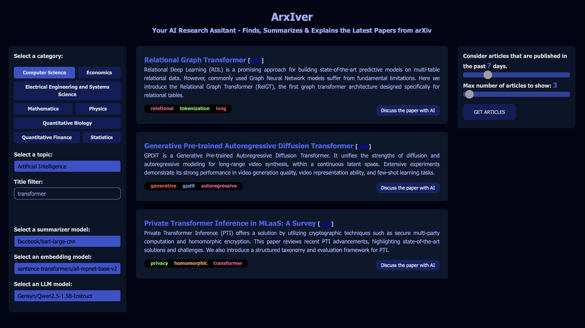
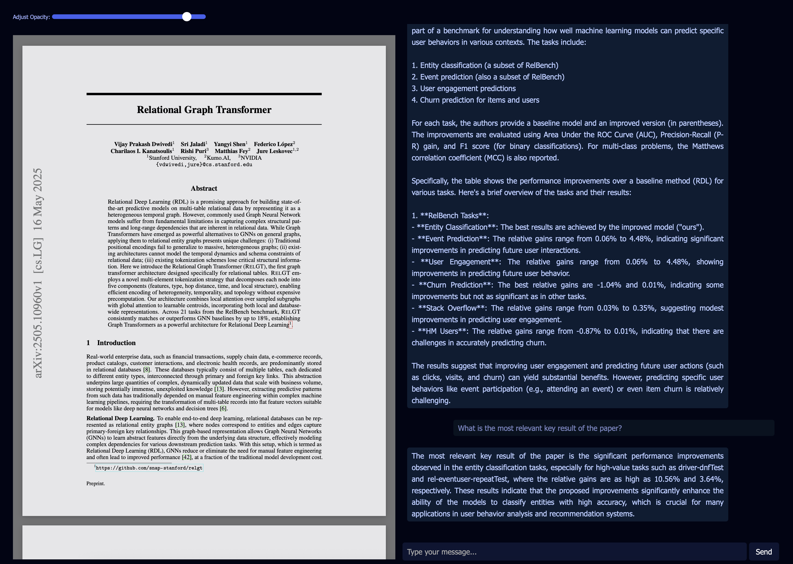
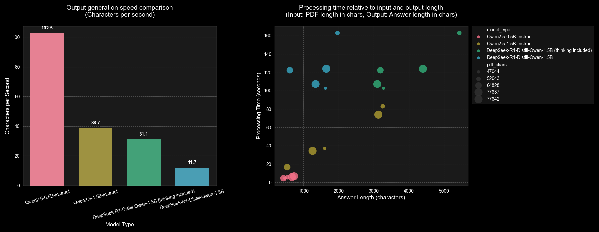

# About the application
This application retrieves the latest and most relevant papers from arXiv via its API, based on specified search criteria. It then:
- Summarizes the paper abstracts 
- Extracts keywords
- Enables interactive discussions with an AI agent about the selected paper. 


Searching criterias are:
  - Category
  - Topic
  - Title filter
  - Date of publish (last X days)
  - Max number of articles to display

The **summarizer**, **embedding** and **LLM models** are configurable, allowing users to specify which models to utilize.

The application can be started by executing the following command from backend/python directory:
```
python3 app.py
```

This will start the backend service and open the frontend with the default browser.

## Retrive summarized papers


## Discussion with an AI agent about the selected paper


# Evaulation of the summarizer models

## facebook/bart-large-cnn

| Rouge-1    | Rouge-2 | Rouge-L | Rouge-L-Sum |
| ---------- | ------- | ------- | ----------- |
| 0.3354     | 0.1437  | 0.2467  | 0.2856      |

## sshleifer/distilbart-cnn-12-6

| Rouge-1    | Rouge-2  | Rouge-L | Rouge-L-Sum |
| ---------- | -------  | ------- | ----------- |
| 0.3389     | 0.1428   | 0.2456  | 0.2831      |

> Calculated on 1000 articles, using cnn_dailymail dataset, details in **evaulation/evaulate_summarizer.py**

# Evaulation of the agent models

## Speed and processing time 



> Measured on Apple M4 (8 core), 16GB memory

> MPS is set for the models (Apple's GPU with increased performance)

> The LLM needed to respond to the following prompt:
"_Explain what the given paper is about and what are the presented results._"

> All the LLM models have used the VectorStoreIndex that was created with the _sentence-transformers/all-mpnet-base-v2_ model.

> Data of the charts and the code that generated: **evaulation/chart.py**

# Model links (huggingface)

| Model                         | Huggingface link  |
| --------------------------    | -------  |
| facebook/bart-large-cnn       | https://huggingface.co/facebook/bart-large-cnn |
| sshleifer/distilbart-cnn-12-6 | https://huggingface.co/sshleifer/distilbart-cnn-12-6 |
| sentence-transformers/all-mpnet-base-v2 | https://huggingface.co/sentence-transformers/all-mpnet-base-v2 |
| sentence-transformers/all-MiniLM-L6-v2 | https://huggingface.co/sentence-transformers/all-MiniLM-L6-v2 |
| Gensyn/Qwen2.5-1.5B-Instruct | https://huggingface.co/Gensyn/Qwen2.5-1.5B-Instruct |
| Gensyn/Qwen2.5-0.5B-Instruct | https://huggingface.co/Gensyn/Qwen2.5-0.5B-Instruct |
| deepseek-ai/DeepSeek-R1-Distill-Qwen-1.5B | https://huggingface.co/deepseek-ai/DeepSeek-R1-Distill-Qwen-1.5B |
